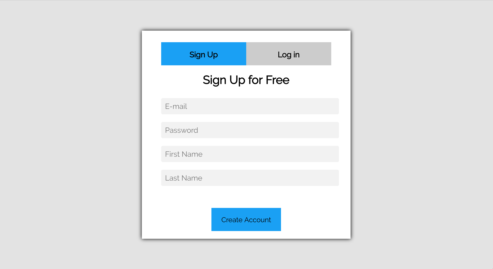
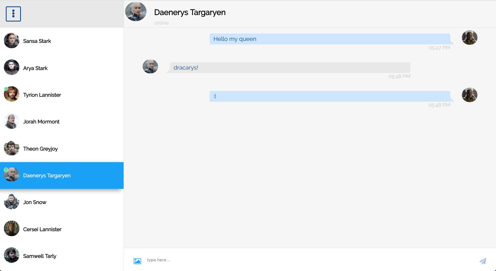

# Chat App
Awesome chat app, backed by firebase realtime database.
Written in plain React, no state managment libraries.

###### Login screen


###### In-App experience



## To Run The Project

Clone the project:
```sh
git clone https://github.com/liatcohen/chat-app.git
```
go to the project directory
```sh
cd chat-app
npm install
```
then:
```sh
npm start
```

Open http://localhost:3000 to view it in the browser.
